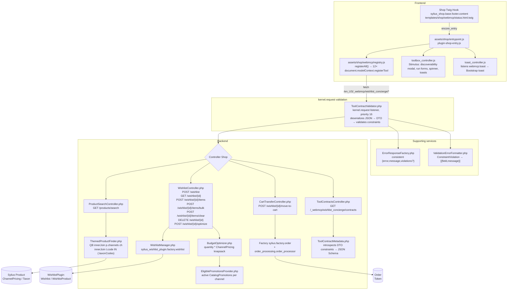

# Wishlist Concierge — A WebMCP implementation for Sylius


<p align="center">
  <a href="https://sylius.com"></a>
  <a href="https://webmachinelearning.github.io/webmcp/"></a>
  <a href="LICENSE"></a>
</p>

**Agent + human co-curate themed, budget-aware gift registries on Sylius.** Instead of clicking 30 filters, you tell your agent *“birthday for my nephew”* — it searches taxons, builds a wishlist, optimizes for budget with Sylius `ChannelPricing`, and moves the best fit to cart after your confirm.

 - Demo: `https://wishlist-concierge.ddev.site/en_US/`
 - Video: ⚠️TODO 
 - Devpost: `https://webmcp.devpost.com`
 - WebMCP Spec: `https://webmachinelearning.github.io/webmcp/`

> **Contest snippet required by judges** — this repo contains `document.modelContext.registerTool` (see `assets/shop/webmcp/registry.js:37`):
> ```js
> await document.modelContext.registerTool({
>   name: "wishlist.create",
>   description: "Create a new themed wishlist",
>   inputSchema: { type: "object", properties: { name:{type:"string"}, theme:{type:"string"} }, required:["name","theme"] },
>   execute: async (input) => fetch(`/en_US/_webmcp/wishlist_concierge/wishlist`, {method:"POST", body: JSON.stringify(input)}).then(r=>r.json()).then(j=>JSON.stringify(j,null,2))
> });
> ```

---

## What People + Agents Can Do Together

**Before:** 30 filter clicks, manual budget math `7589+1703+...`, missed `CatalogPromotion`, abandoned cart. **After:** one conversation.

**Story 1 — Themed gift**
> User: “birthday for my nephew”
> Agent: `product.search {theme:"gift"}` → returns `Ethereal_Drift_T_Shirt` etc. Human: “more books, less plastic” → agent swaps via `wishlist.add_item`.

**Story 2 — Budget**
> Agent: `wishlist.optimize_for_budget {wishlistId:2, budgetCents:15000}` → `BudgetOptimizer.php:25` cheapest-first knapsack with `quantity * ChannelPricing` → `chosen:["Lunar_Echo_T_Shirt-variant-0"], total $17.03, $7 remaining` + explanation string. Human decides to increase budget.

**Story 3 — Share & Checkout**
> `wishlist.move_to_cart {wishlistId:2}` → `CartTransferController.php:21` triggers `window.confirm("Move 1 item ($17.03) to cart?")` at `registry.js:196` (spec Mitigation 6.3.2 — agent cannot finalize without human). `OrderFactory` + `OrderProcessor` → `cartToken` + `/en_US/cart`. Anon allowed (`FASHION_WEB` gift registries are shareable via `WishlistAccessChecker.php:21` — owned lists still `403`).

## Architecture



**Folder map**

```
config/packages/bitexpert_wishlist_concierge.yaml  → themes param
config/services/webmcp.yaml                         → services private:true, controllers public:true
config/twig_hooks/shop.yaml                         → sylius_shop.base.footer.content badge
src/Dto/* (9)                                       → #[Assert] validation (WishlistCreateRequest, WishlistAddItemRequest, WishlistRemoveItemRequest, WishlistBulkAddRequest, WishlistClearRequest, WishlistDeleteRequest, BudgetOptimizeRequest, MoveToCartRequest, ProductSearchRequest)
src/Security/ToolContractValidator.php              → kernel.request listener: deserializes JSON → DTO → validates constraints → 422 on failure
src/Security/WishlistAccessChecker.php              → shareable anon vs owned 403
src/Controller/Shop/ToolContractsController.php     → GET /_webmcp/wishlist_concierge/contracts, GET /_webmcp/wishlist_concierge/contracts/{tool} — machine-readable JSON Schema
src/Service/ThemedProductFinder.php                 → channel-scoped QB, mapProduct()
src/Service/BudgetOptimizer.php                     → int cents + quantity + CatalogPromotion integration
src/Service/ToolContractMetadata.php                → introspects DTO constraint metadata → JSON Schema for each tool
src/Service/ErrorResponseFactory.php                → centralized {error,message,violations?} JSON envelope
src/Service/ValidationErrorFormatter.php            → ConstraintViolation → [{field,message}]
src/Command/ConciergeTagsSetupCommand.php           → bitexpert:wishlist-concierge:setup-tags — creates concierge_tags attribute + tags products
templates/shop/webmcp/status.html.twig              → {{ 'bitexpert_wishlist_concierge.shop.status.label'|trans }}
translations/messages.en.yaml                       → EN keys
tests/Unit/Service/BudgetOptimizerTest.php          → 3 cases, phpunit
assets/shop/webmcp/registry.js                      → Promise.allSettled race fix, apiFetch parses {error,message,violations}, withErrorHandling wrapper per tool
assets/shop/webmcp/controllers/toolbox_controller.js → Stimulus: discoverability modal, form generation from inputSchema, spinner, run button
assets/shop/webmcp/controllers/toast_controller.js  → listens webmcp:toast, renders Bootstrap toast (error/success/info)
```

## WebMCP Tool Reference — Full JSON Schema Inline

All tools are imperative at `assets/shop/webmcp/registry.js:37` via `document.modelContext.registerTool(tool, {signal})`. `name` regex `^[A-Za-z0-9_.-]{1,128}$`.

**Error handling:** Every tool's `execute` function is wrapped by `withErrorHandling()` — if the underlying API call throws, the tool returns a structured `{error, message}` JSON payload instead of crashing the agent. The `apiFetch()` helper also parses server-side `{error, message, violations}` envelopes so the front-end (and the agent) always receives a consistent error shape.

**Custom events (DOM):** Tools dispatch events that the UI listens to for live feedback:

| Event                       | Fired by                            | Payload                       |
|-----------------------------|-------------------------------------|-------------------------------|
| `webmcp:toast`              | `toolbox_controller.js`, `apiFetch` | `{type: "success"|"error"|"info", message}` |
| `webmcp:wishlist-created`   | `wishlist.create_themed`            | `{wishlist: {id, name, ...}}` |
| `webmcp:wishlist-updated`   | `wishlist.add_item`                 | `{wishlist: {...}}`           |
| `webmcp:promotions-applied` | `wishlist.optimize_for_budget`      | `{promotionsApplied: [...]}`  |
| `webmcp:cart-created`       | `wishlist.move_to_cart`             | `{cartToken, cartUrl, ...}`   |
| `webmcp:ready`              | `registerAll()`                     | `{count: 9}`                  |

### `wishlist.list` — `readOnlyHint:true`
List recent wishlists for the current channel.
```json
{
  "name": "wishlist.list",
  "description": "List recent wishlists for the current channel. The active channel is automatically inferred from the current Sylius context. Use to discover existing wishlists before creating a new themed one.",
  "inputSchema": {
    "type": "object",
    "properties": {}
  },
  "execute": "GET /en_US/_webmcp/wishlist_concierge/wishlist → {wishlists:[{id,token,name,channelCode,items}], channelCode}"
}
```

### `wishlist.get` — `readOnlyHint:true`
```json
{
  "name": "wishlist.get",
  "description": "Get details of a single wishlist by id, including items with variantCode, productName, price and quantities.",
  "inputSchema": {
    "type": "object",
    "properties": { "wishlistId": { "type": "integer", "description": "Wishlist id" } },
    "required": ["wishlistId"]
  },
  "execute": "GET /en_US/_webmcp/wishlist_concierge/wishlist/{id} → {wishlist:{id,token,name,items:[{wishlistProductId,variantCode,productCode,productName,quantity,price,originalPrice}]}}"
}
```

### `wishlist.create`
```json
{
  "name": "wishlist.create",
  "description": "Create a new themed wishlist. The active channel is automatically inferred from the current Sylius context. Theme examples: birthday, gift, summer, casual, formal. Name should be human readable like \"Birthday Wishlist — $150\".",
  "inputSchema": {
    "type": "object",
    "properties": {
      "name": { "type": "string", "description": "Wishlist name, e.g. Birthday Wishlist — $150" },
      "theme": { "type": "string", "description": "Theme keyword: birthday, gift, summer, etc." }
    },
    "required": ["name","theme"]
  },
  "constraints": "WishlistCreateRequest.php #[Assert\\NotBlank, Length(max:100), Regex ^[\\pL\\pN\\s\\-_]+$]",
  "execute": "POST /en_US/_webmcp/wishlist_concierge/wishlist {name,theme} → 201 {wishlist} | 422 {violations}"
}
```

### `product.search` — `readOnlyHint:true`
```json
{
  "name": "product.search",
  "description": "Search products by theme and optional taxon/price filters. The active channel is automatically inferred from the current Sylius context. Returns products with code, name, variantCode, price (cents), taxonCodes for curation. Matches products tagged with the concierge_tags attribute (e.g. \"gift\", \"summer\") or whose name contains the theme string.",
  "inputSchema": {
    "type": "object",
    "properties": {
      "theme": { "type": "string", "description": "Theme keyword" },
      "taxonCodes": { "type": "array", "items": { "type": "string" }, "description": "Optional taxon filter e.g. [\"t_shirts\",\"caps\"]" },
      "priceMinCents": { "type": "integer", "description": "Min price cents" },
      "priceMaxCents": { "type": "integer", "description": "Max price cents" },
      "limit": { "type": "integer", "default": 12, "minimum": 1, "maximum": 50 }
    },
    "required": ["theme"]
  },
  "execute": "GET /en_US/_webmcp/wishlist_concierge/products/search?theme=&taxonCodes[]=&priceMin=&priceMax=&limit= → {count, products:[{code,name,slug,price,originalPrice,taxonCodes,image,variantCode}]} | 404 {error:\"Channel not found\"} | 422 priceMin>priceMax"
}
```

### `product.get_details` — `readOnlyHint:true`
```json
{
  "name": "product.get_details",
  "description": "Get product details by productCode, including variants and pricing.",
  "inputSchema": {
    "type": "object",
    "properties": { "productCode": { "type": "string" } },
    "required": ["productCode"]
  },
  "execute": "GET /api/v2/shop/products/{code} (Accept: application/ld+json)"
}
```

### `wishlist.add_item`
```json
{
  "name": "wishlist.add_item",
  "description": "Add a product variant to a wishlist by variantCode and quantity.",
  "inputSchema": {
    "type": "object",
    "properties": {
      "wishlistId": { "type": "integer" },
      "variantCode": { "type": "string", "description": "Variant code like T_SHIRT_VARIANT", "pattern": "^[A-Za-z0-9._-]+$" },
      "quantity": { "type": "integer", "default": 1, "minimum": 1, "maximum": 99 }
    },
    "required": ["wishlistId","variantCode"]
  },
  "execute": "POST /en_US/_webmcp/wishlist_concierge/wishlist/{id}/items {variantCode,quantity} → {wishlist} | 422 Invalid variant code format | 400 Variant not found | 403 token mismatch"
}
```

### `wishlist.optimize_for_budget` — `readOnlyHint:true`
```json
{
  "name": "wishlist.optimize_for_budget",
  "description": "Optimize a wishlist for a budget (cents, USD). Applies eligible Sylius catalog promotions when includePromotions is true: returns chosen variantCodes, totalCents/savedCents, the list of active promotionsApplied and a human explanation. Use before move_to_cart to stay under budget.",
  "inputSchema": {
    "type": "object",
    "properties": {
      "wishlistId": { "type": "integer" },
      "budgetCents": { "type": "integer", "description": "Budget in cents, e.g. 15000 for $150", "minimum": 1, "maximum": 10000000 },
      "includePromotions": { "type": "boolean", "default": true, "description": "Apply eligible Sylius catalog promotions when computing the optimal set" }
    },
    "required": ["wishlistId","budgetCents"]
  },
  "constraints": "BudgetOptimizeRequest.php #[Assert\\NotNull, Positive, LessThanOrEqual(10000000)]",
  "execute": "POST /en_US/_webmcp/wishlist_concierge/wishlist/{id}/optimize {budgetCents,includePromotions} → {wishlistId,budgetCents,budgetFormatted,chosen:[variantCode],totalCents,totalOriginal,savedCents,totalFormatted,savedFormatted,explanation,promotionsApplied:[{code,name}],promotionsIgnored:bool}"
}
```

### `wishlist.move_to_cart`
```json
{
  "name": "wishlist.move_to_cart",
  "description": "Move wishlist items to cart (anon allowed). Requires human confirmation — the tool will show a confirm dialog in the page before proceeding. Optionally pass variantCodes to move subset, else all.",
  "inputSchema": {
    "type": "object",
    "properties": {
      "wishlistId": { "type": "integer" },
      "variantCodes": { "type": "array", "items": { "type": "string", "pattern": "^[A-Za-z0-9._-]+$" }, "description": "Subset to move, omit for all" }
    },
    "required": ["wishlistId"]
  },
  "execute": "GET /wishlist/{id} preview → window.confirm(\"Move N items ($X) to cart?\") → POST /en_US/_webmcp/wishlist_concierge/wishlist/{id}/move-to-cart {variantCodes} → 201 {cartToken,items:[{variantCode,quantity,unitPrice,total}],total,totalFormatted,cartUrl:\"/en_US/cart\"} | {canceled:true} if declined | AbortSignal respected"
}
```

### `wishlist.delete`
```json
{
  "name": "wishlist.delete",
  "description": "Delete a wishlist permanently.",
  "inputSchema": {"type": "object","properties": {}},
  "confirmMessage": "Are you sure you want to permanently delete this wishlist? This cannot be undone.",
  "destructiveHint": true,
  "emitsEvents": ["webmcp:wishlist-deleted"],
  "pathParams": {"wishlistId":"id"}
}
```

### `wishlist.bulk_add`
```json
{
  "name": "wishlist.bulk_add",
  "description": "Add multiple product variants to a wishlist in one call. Input is an array of {variantCode, quantity} objects.",
  "inputSchema": {"type": "object","properties": {"wishlistId": {"type": "integer"},"items": {"type": "array","items": {"type": "object","properties": {"variantCode": {"type": "string"},"quantity": {"type": "integer","default": 1}},"required": ["variantCode"]}}},"required": ["wishlistId","items"]},
  "emitsEvents": ["webmcp:wishlist-updated"],
  "pathParams": {"wishlistId":"id"}
}
```

### `wishlist.clear`
```json
{
  "name": "wishlist.clear",
  "description": "Remove all items from a wishlist in one call. Useful for resetting a themed list before re-curating.",
  "inputSchema": {"type": "object","properties": {"wishlistId": {"type": "integer"}},"required": ["wishlistId"]},
  "destructiveHint": true,
  "emitsEvents": ["webmcp:wishlist-updated"],
  "pathParams": {"wishlistId":"id"}
}
```

## Machine-Readable Tool Contracts

The repository exposes the `inputSchema` of every imperative tool as **JSON-Schema** over HTTP, introspected directly from the Symfony Validator constraints on each tool's input DTO (`ToolContractMetadata`). This makes the "structured contract" declared via WebMCP discoverable by any API consumer or test client, and guarantees the documented schema and the server-side validation are always in sync.

| Endpoint                                                 | Description                                                          |
|----------------------------------------------------------|----------------------------------------------------------------------|
| `GET /en_US/_webmcp/wishlist_concierge/contracts`        | List all tool contracts, e.g. `{tools:[{name,dto,inputSchema}]}`     |
| `GET /en_US/_webmcp/wishlist_concierge/contracts/{tool}` | Single contract for a tool, e.g. `/contracts/wishlist.create_themed` |

The front-end `registry.js` `inputSchema` mirrors these contracts — the server-side `ToolContractValidator` enforces them on every request, so the schema shown in this reference, the tool advertised to the agent, and the payload actually validated are all one and the same.

## Installation — Plugin Skeleton (Test Application)

**This is a Sylius plugin, not a Sylius project.** The host app is `vendor/sylius/test-application` (Symfony kernel `Sylius\TestApplication\Kernel`). See `docs.sylius.com/plugins-development-guide/test-application`.

```bash
composer require bitexpert/sylius-wishlist-concierge-plugin
```

**For this repo (DDEV):**

1. `ddev start` → `https://wishlist-concierge.ddev.site` (docroot `vendor/sylius/test-application/public`, `php 8.4`, `mariadb 11.8`, `nodejs 24` at `.ddev/config.yaml:3`)
2. Hook installed via `tests/TestApplication/config/bundles.php:4` (`SyliusWishlistPlugin`, `BitExpertSyliusWishlistConciergePlugin`) + `tests/TestApplication/.env` `SYLIUS_TEST_APP_*` (`@BitExpertSyliusWishlistConciergePlugin/config/config.yaml` etc.)
3. DB:
   ```bash
   ddev exec vendor/bin/console doctrine:database:create --if-not-exists
   ddev exec vendor/bin/console doctrine:migrations:migrate -n
   ddev exec vendor/bin/console sylius:fixtures:load -n   # FASHION_WEB + standard t_shirts/caps/mugs/dresses/jeans
   ```
4. Tag products for theme search (creates the `concierge_tags` product attribute and tags the demo products):
   ```bash
   ddev exec vendor/bin/console bitexpert:wishlist-concierge:setup-tags -n
   ddev exec vendor/bin/console bitexpert:wishlist-concierge:setup-tags --dry-run   # preview without persisting
   ```
5. Assets (`webpack.config.js:24` `plugin-shop-entry` → `assets/shop/entrypoint.js:1` → `assets/shop/webmcp/registry.js:30`):
   ```bash
   ddev exec bash -c "cd vendor/sylius/test-application && yarn build"
   # → public/build/app/shop/plugin-shop-entry.*.js (now 87.5 KiB)
   ```
6. Open `https://wishlist-concierge.ddev.site/en_US/` → footer badge `WebMCP: 12 tools ready` (via `templates/shop/webmcp/status.html.twig:1` hook `sylius_shop.base.footer.content`).

**Traditional (no DDEV):**
```bash
(cd vendor/sylius/test-application && yarn install && yarn build) && vendor/bin/console assets:install
symfony server:start -d  # https://localhost:8000
```

## Testing

**Unit — quantity-aware optimizer** `tests/Unit/Service/BudgetOptimizerTest.php:15` (3 cases, no DB):

```bash
ddev exec vendor/bin/phpunit tests/Unit/Service/BudgetOptimizerTest.php --testdox
# ✔ Optimize selects cheapest within budget | ✔ Budget too low → [] | ✔ Handles quantity (3×1000+ promotion)
```

**Playwright CLI** (you have `microsoft/playwright-cli` via `npm install -g @playwright/cli`):
```bash
playwright-cli -s=wishlist open https://wishlist-concierge.ddev.site/en_US/ --ignore-https-errors
playwright-cli -s=wishlist eval "await document.modelContext.getTools().then(t=>t.map(x=>x.name))"
# → ["wishlist.list","wishlist.get","wishlist.create","wishlist.delete","wishlist.bulk_add","wishlist.clear","product.search","product.get_details","wishlist.add_item","wishlist.remove_item","wishlist.optimize_for_budget","wishlist.move_to_cart"]
playwright-cli -s=wishlist eval "await document.modelContext.executeTool((await document.modelContext.getTools()).find(t=>t.name==='product.search'),{theme:'gift',limit:2})"
```

**Machine-readable contracts (verify server-side schema is in sync):**
```bash
curl -s https://wishlist-concierge.ddev.site/_webmcp/wishlist_concierge/contracts | python3 -m json.tool   # all 4 imperative tools
curl -s https://wishlist-concierge.ddev.site/_webmcp/wishlist_concierge/contracts/wishlist.create | python3 -m json.tool
```

**Style:**
```bash
ddev exec vendor/bin/ecs check src
ddev exec vendor/bin/console lint:twig templates/shop/webmcp/
```

## Configuration

```yaml
# config/packages/bitexpert_wishlist_concierge.yaml
parameters:
  bitexpert_wishlist_concierge.themes:
    birthday: ['caps', 't_shirts', 'mugs']
    gift: ['mugs', 'caps', 't_shirts', 'dresses']
    # add without deploy
```

Channel is determined automatically via `ChannelContext`; override via FASHION_WEB setting.

## Security

`src/Security/WishlistAccessChecker.php:21` — owned wishlists (`getShopUser() !== null`) require `ROLE_USER` + owner `id` match → `403`. Anonymous gift registries are *shareable by design* (`shopUser === null` → allow) — required for contest anon `move_to_cart`. To lock anon to cookie, uncomment token check `wishlist.getToken() !== cookieTokenResolver->resolve()`.

### WebMCP tool contract validation

`src/Security/ToolContractValidator.php` is a `kernel.request` event listener (priority 16) that centralizes **server-side validation of the WebMCP tool contracts**. For every imperative `/_webmcp/wishlist_concierge/*` endpoint that accepts a JSON payload (`create`, `add_item`, `optimize`, `move_to_cart`), it:

1. Deserializes the request body into the tool's declared input DTO (from `ToolContractValidator::TOOL_CONTRACTS`),
2. Validates it against the DTO's `#[Assert]` constraints,
3. On failure returns a **single, deterministic `422`** response shaped by `ErrorResponseFactory` + `ValidationErrorFormatter`.

This means the "structured contract" promised by WebMCP is honoured regardless of which client (browser, script, test) invokes it — the schema advertised to the agent is exactly the payload the server enforces. On success, the validated DTO is exposed to the controller via the `_webmcp_validated_dto` request attribute.

```bash
# e.g. a malformed payload now returns a structured 422 (not a crash)
curl -s -X POST https://wishlist-concierge.ddev.site/en_US/_webmcp/wishlist_concierge/wishlist \
  -H "Content-Type: application/json" -d '{"name":"","theme":""}' | python3 -m json.tool
# → {"error":"Validation failed","message":"The tool input does not satisfy its declared contract.",
#    "violations":[{"field":"name","message":"Wishlist name must not be blank."}, ...]}
```

## License

MIT — see `LICENSE`. Sylius is MIT, WishlistPlugin is MIT.

---

*Built for `webmcp.devpost.com` — `OpenAI WebMCP Challenge`. Hosted at `https://wishlist-concierge.ddev.site` (ChatGPT in-app browser or Chrome 149 `chrome://flags/#enable-webmcp-testing`).*
