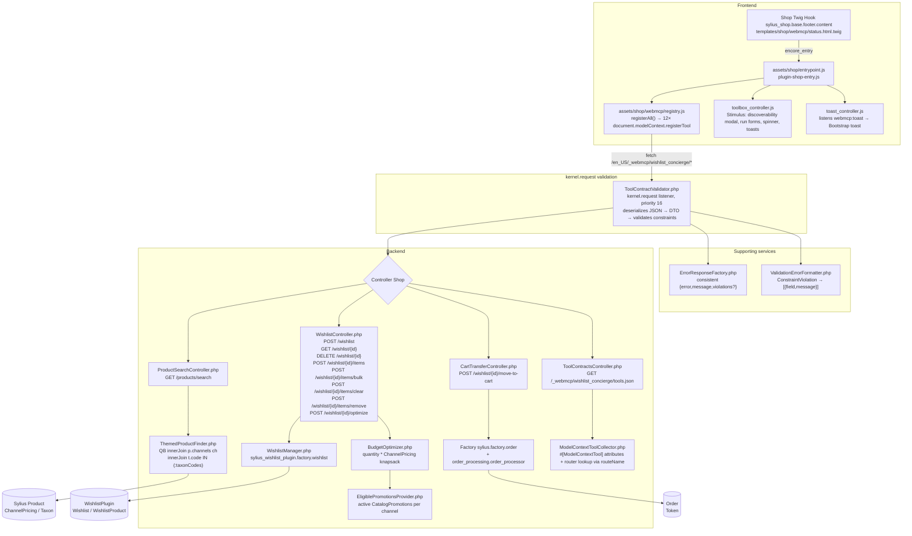

# Architecture



## Folder map

```
config/packages/bitexpert_wishlist_concierge.yaml  → themes param
config/routes/shop.yaml                             → explicit YAML routes for all WebMCP endpoints (no #[Route] attributes, no wildcard import)
config/services/webmcp.xml                          → services private:true, controllers public:true
config/twig_hooks/shop.yaml                         → sylius_shop.base.footer.content badge
src/Dto/* (9)                                       → #[Assert] validation (WishlistCreateRequest, WishlistAddItemRequest, WishlistRemoveItemRequest, WishlistBulkAddRequest, WishlistClearRequest, WishlistDeleteRequest, BudgetOptimizeRequest, MoveToCartRequest, ProductSearchRequest)
src/Security/ToolContractValidator.php              → kernel.request listener: deserializes JSON → DTO → validates constraints → 422 on failure
src/Security/WishlistAccessChecker.php              → shareable anon vs owned 403
src/Controller/Shop/ToolContractsController.php     → GET /_webmcp/wishlist_concierge/tools.json — machine-readable tool manifest
src/Service/ModelContextToolCollector.php           → reads #[ModelContextTool] attributes, resolves route URL via routeName lookup; builds manifest
src/Service/ThemedProductFinder.php                 → channel-scoped QB, mapProduct()
src/Service/BudgetOptimizer.php                     → int cents + quantity + CatalogPromotion integration
src/Service/ErrorResponseFactory.php                → centralized {error,message,violations?} JSON envelope
src/Service/ValidationErrorFormatter.php            → ConstraintViolation → [{field,message}]
src/Command/ConciergeTagsSetupCommand.php           → bitexpert:wishlist-concierge:setup-tags — creates concierge_tags attribute + tags products
templates/shop/webmcp/status.html.twig              → {{ 'bitexpert_wishlist_concierge.shop.status.label'|trans }}
translations/messages.en.yaml                       → EN keys
tests/Unit/Service/BudgetOptimizerTest.php          → 3 cases, phpunit
assets/shop/webmcp/registry.js                      → Promise.allSettled race fix, apiFetch parses {error,message,violations}, withErrorHandling wrapper per tool
assets/shop/webmcp/controllers/toolbox_controller.js → Stimulus: discoverability modal, form generation from inputSchema, spinner, run button
assets/shop/webmcp/controllers/toast_controller.js  → listens webmcp:toast, renders Bootstrap toast (error/success/info)
```

## Security

`src/Security/WishlistAccessChecker.php:34` — owned wishlists (`getShopUser() !== null`) require `ROLE_USER` + owner `id` match → `403`. Anonymous gift registries are *shareable by design* (`shopUser === null` → allow) — required for contest anon `move_to_cart`. To lock anon to cookie, uncomment token check `wishlist.getToken() !== cookieTokenResolver->resolve()`.
